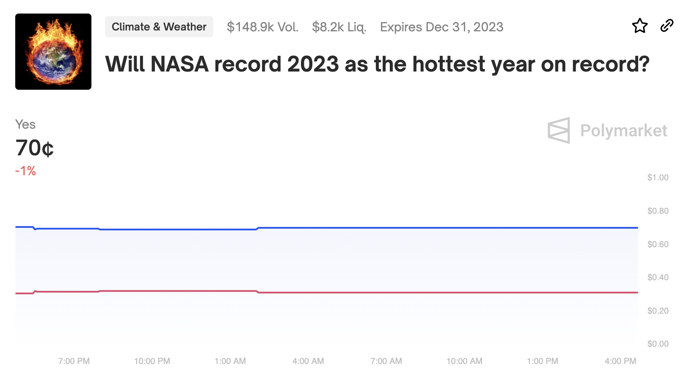
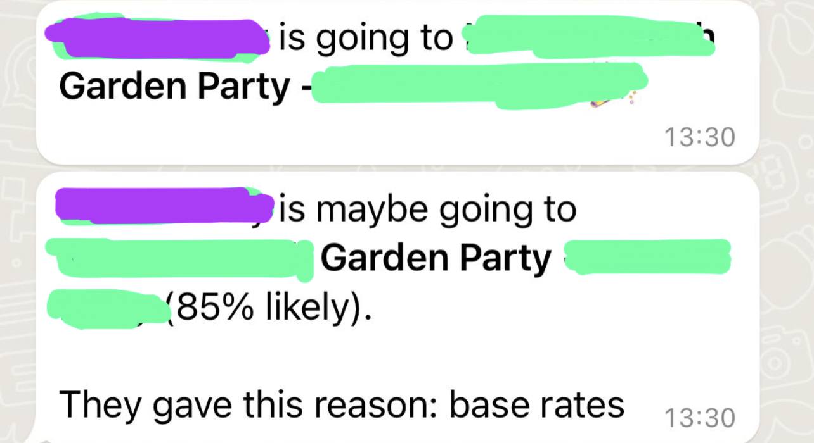

- [[Bad Events]]
- [[It's Connection All The Way Down]]
- What do [[Climate Change]] skeptics think of this market? Like, what do they think in response?
	- [[market]] https://polymarket.com/event/will-nasa-record-2023-as-the-hottest-year-on-record
	- 
- Turns out that [[Asana]] is a perfectly good [[forecasting question creation tool]]. [[error]] from me
- Get you a man who
	- {:height 218, :width 317}
	-
	-
- [[Two Processes for Better Decisionmaking]]
- [[anecdote]] my friend tells me that in their work in [[East Africa]] polygamy is the dominant relationship style. It's pretty patriarchal, but the men all have multiple wives/girlfriends and many of the women have other boyfriends.
	- It's seen as unacceptable to demand someone only sleeps with you
	- *monogamy is a western Christian norm*
- [[Joke about outcomes you want]] {{video https://www.youtube.com/watch?v=BJjQyP2c5Dk}}
-