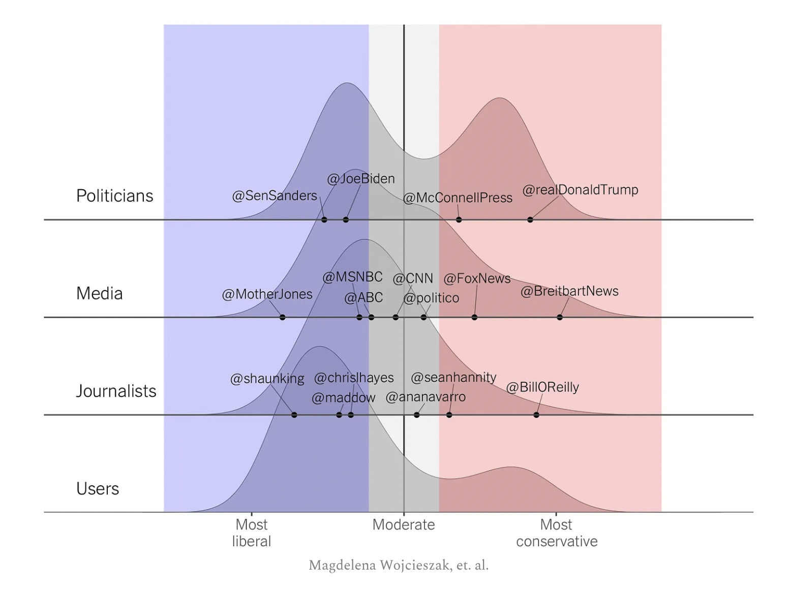

- [[The House of Lords is Pretty Good]]
- [[The US Electoral College]]
- [[EA Criticism]]
- [[Vibes]] [[Twitter]] https://www.natesilver.net/p/twitter-elon-and-the-indigo-blob [[Nate Silver]] 
	- [[quote]] [[Nate Silver]] But considering that Twitter was already left-skewed, and that Trump was by far the most prominent exception, [banning Trump] further entrenched Twitter as a space for the Blob to talk amongst itself, without all the [deplorables](https://www.nytimes.com/2016/09/11/us/politics/hillary-clinton-basket-of-deplorables.html) to get in the way. That’s why, to a certain type of progressive figure, it literally felt like Musk was [“opening the gates of hell”](https://www.washingtonpost.com/technology/2022/11/24/twitter-musk-reverses-suspensions/) when he unbanned Trump and other conservative accounts.
- [[Quote]] [[Brad Bird]] Animation isn't a genre, westerns are a genre... Anime is an artform
- [[moving]] {{video https://www.youtube.com/watch?v=IGaN66dcZEs}}
-
-
-