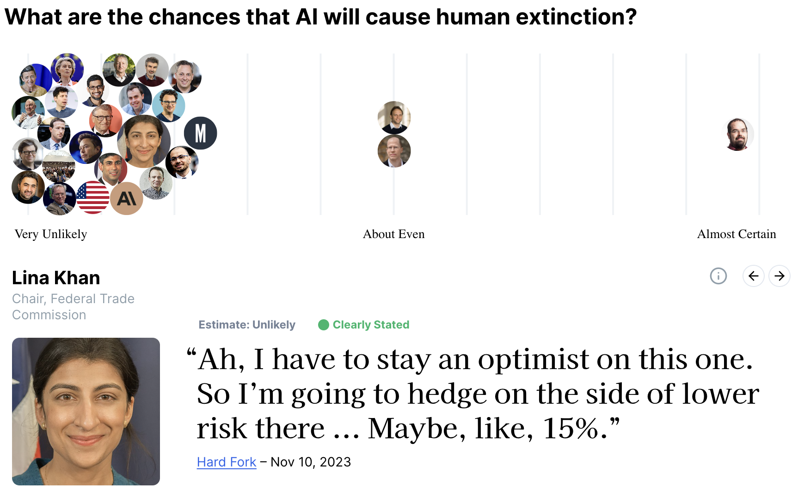

- [[Blog]]
- Last week it came to light that [[OpenAI]] had been using non-disparagement agreements enforced by removal of vested "shares". In short, employees leaving were told that if they didn't sign the agreement never to talk badly about OpenAI then they would lose millions of dollars of value that they had thought they had built up.
- This was bad and almost certainly highly deliberate. Sam Altman claims he is surprised, but this seems unlikely. He presided over a company building world-defining tech that put a giant tax on any criticism at all. People have rightly been scandalised; Altman claims he is embarrassed.
- All this came to light because one engineer, Daniel Kokotajlo, refused to sign the agreement, forgoing what he guesses was 85% of his family's wealth at the time in order to be able to speak out against OpenAI if necessary. As time goes on we are seeing email chains from OpenAI that look increasing aggressive from OpenAI.
- Many people in the AI space think that AI could plausibly kill everyone on earth. The median journal author on AI thinks there is about a 5% chance of this. I've recently run a project to find 40 quotes from experts on different AI questions. Even many governments and tech executives talk as if the risk is higher than 10%.
- {:height 301, :width 587}
- We need to do better than relying on the integrity of individual engineers against millions of dollars paid to them to keep quiet.
- Here are three suggestions:
	- Offer to match 50% of funds lost by whistleblowers.
		- Offering Kokotajlo 50% of the money he was set to make if didn't sign the NDA sounds like both an insult and a huge waste. But it isn't. People really care about the money they make and there is much more money in AI safety than this.
		- Make clear that whistleblowers will be taking a hit but not a huge one. I know if i had a family and potentially millions coming to me if I stayed quiet, I would be tempted to. Altman certainly knows this - his gambit around the OpenAI board crisis shows a shrewd understanding of how income motivates his staff.
		- This is good value for money. How much would some AI safety focused foundations pay to place a person with integrity in OpenAI? I guess it is $1 - $10mn. Here you have someone who can give an accurate account of why they left a well-paying AI Safety role. I suggest that is worth a lot of money, especially if they are willing to forgo half of what they would have made. (This is a costly signal of integrity)
	- Create an integrity prize
		- There is much to celebrate here. A man looked at millions and decided he'd rather have the ability to speak honestly. That seems like the sort of behaviour we should want in the world. I want people who would hide Jews under their floorboards, I want people would walk away from interesting scientific problems to avoid building the nuclear bomb (Szilard) and I want people who value their honesty more than millions of dollars when they are developing world changing tech.
		- Give a medium sized prize every year. Perhaps $100k as an AI Integrity prize. Find a set of judges who have demonstrated intellectual and practical integrity in the past and get them to vote every year for someone to award it to. Someone who has borne personal cost in AI to maintain their integrity.
		- Don't be dumb about it. I would recommend Kokotajlo gets the inaugural award, but have an investigatory team on the staff to kick the tires (perhaps consider Kelsey Piper, who has a reputation of this to maintain). Aim to be 90+% confident that they will still endorse the award in 10 years, perhaps vote otherwise.
	- Talk to your elected representatives, donate to AI safety organisations.
		- Money makes a difference. I generally think that people should pay more for the things they want to protect. So rather than relying on the honesty of a few researchers, I want to use my time and money to push for changes.
		-
	-