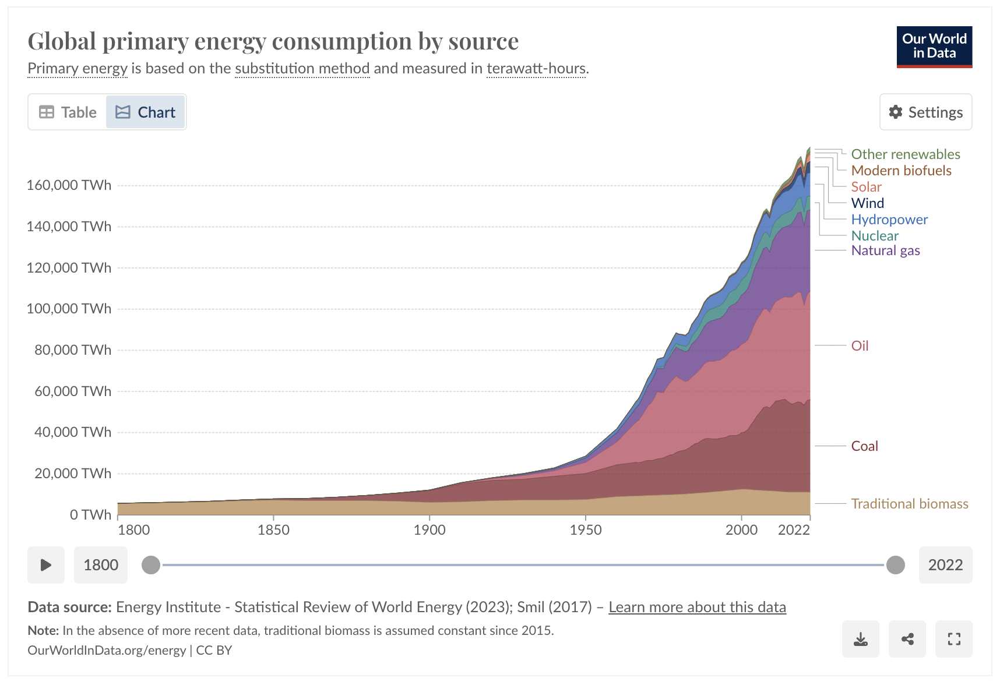
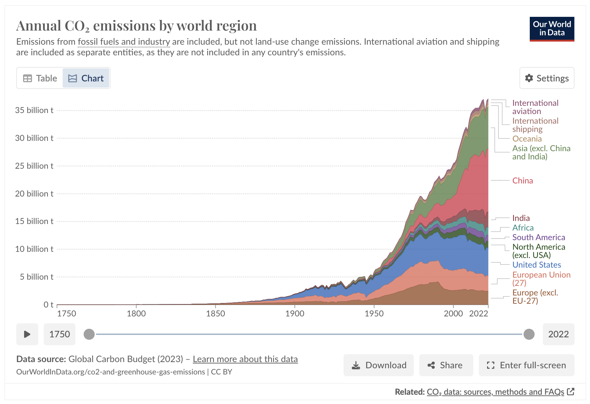

- I sense it's gonna be okay
- Carbon is starting to peak
- <iframe src="https://ourworldindata.org/grapher/annual-co2-emissions-per-country?country=~OWID_WRL" loading="lazy" style="width: 100%; height: 600px; border: 0px none;"></iframe>
- <iframe src="https://www.metaculus.com/questions/question_embed/605/?theme=light" style="height:430px; width:100%; max-width:550px"></iframe>
- How much energy does each nation use?
- Why is switching to other sources happening so slowly
	- 
- What would need to be built in different countries to change the energy mix?
	- 
	-
	- US
	- China
	- India
-