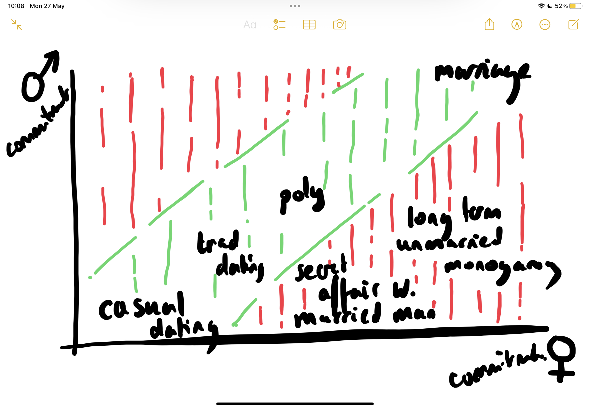

- Theory (unendorsed) - If your relationship isn't where you want it, seek for more negotiatiating capital

  - Women enter long-term monogamous situations without long-term commitment. Sometimes they date someone for 7 years only to find that he doesn't want children, wasting a huge amount of their dating years.
  - Negotiating the pull back can be difficult - how do you say to someone you have dated for 5 years that you are deeply upset. What if they don't do anything about it? What is the implicit threat?
  - Under this model, the woman should threaten to move out or start dating again.
    - She is providing "the wife experience" on girlfriend wages. This is very convenient for her (probably male) parner, but means he gets what he wants without her getting what she wants.
      - Under this model, modern men want a friend, a sexual partner someone to help around the house, but they don't necessarily want to long term commit to have children with this person.
      - Women, if they want children, (or other long term commitments) deeply enjoy a sexual parner, friend and housemate, but can be left stranded if this situation plays out for years
  - 
  - There is some deeper question about growth. What is the kind of growth to aim for and how does one get it?

- There is a difference between being scared of commitment and predicting that one is incapable of keeping the commitment.
-
