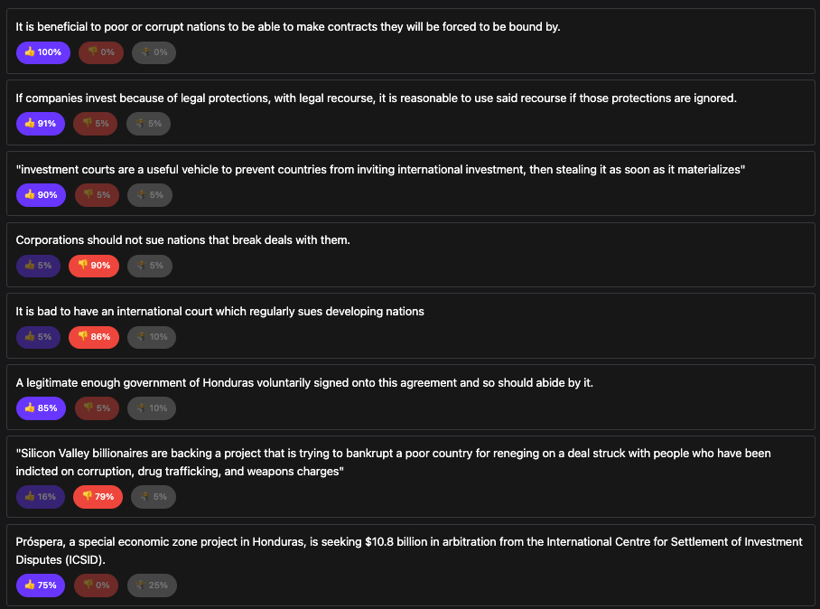
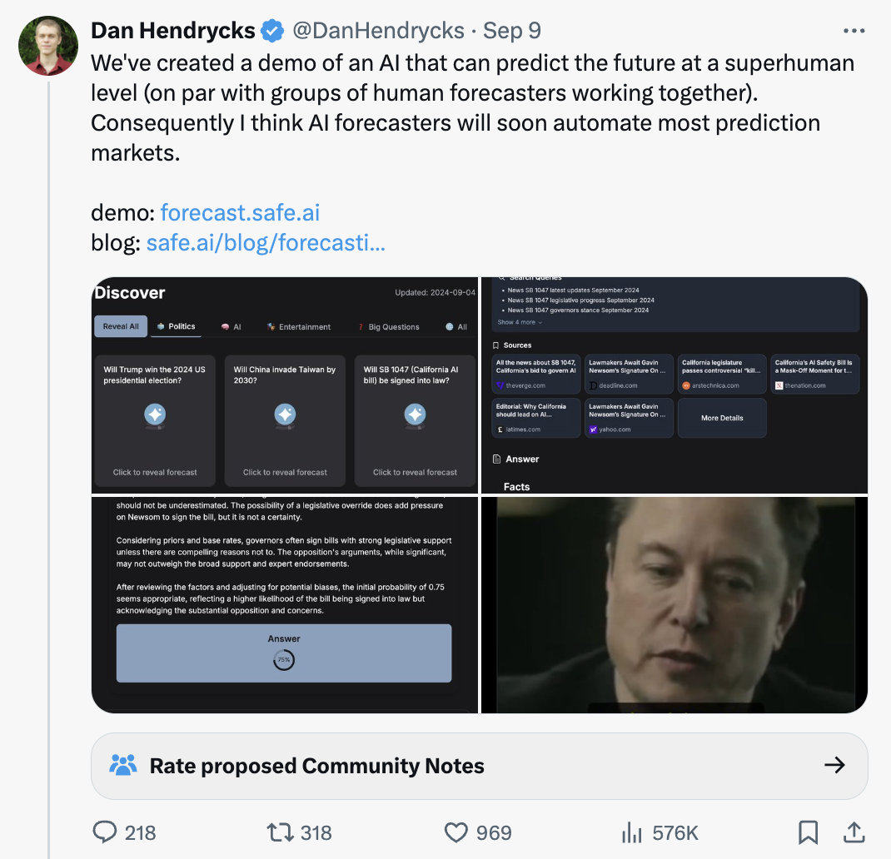
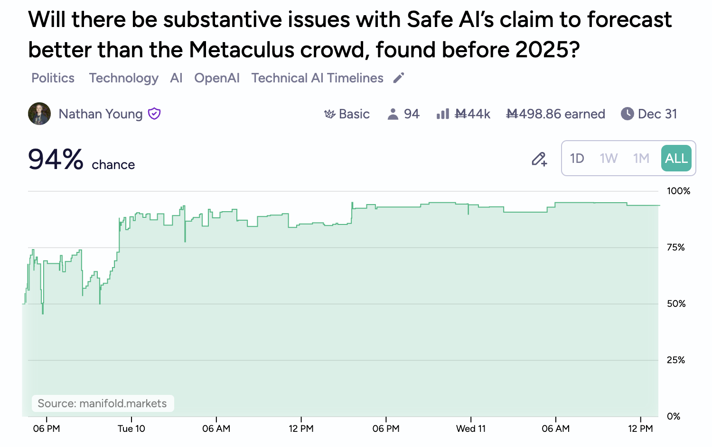

- With [[Ben Pace]]
	- Ben and I did a private debate on whether EA should shut down.
	- The format was as follows
		- Each of us wrote a 1 page document
		- We read through each other's documents
		- Each of us led an hour of discussion, where we could push the other. Using [[LessWrong]]'s dialoguing tool
	- Takeaways
		- It felt okay
		- It was good to have a somewhat adversarial discussion with lots of room to think and breathe
		- There wasn't a clear "so what"
		- It pointed out the specific disagreements
		- Not clear that we [[Saving progress in debates]] anywhere useful
- Between [[Garrison Lovely]] and [[Scott Alexander]]
	- Garrison wrote a long post about [[Prospéra]] in Honduras. Scott responded. Each the responded 1 additional time.
	- It felt to me like Lovely was more wrong, but in some intangible way
	- I could have drawn an [[Argument tree]] but somehow that didn't feel good
	- I read through the arguments, made a [[Viewpoints]] poll of them - https://viewpoints.xyz/polls/garrison-lovely-scott-alexander-prospera-debate?sort=consensus
	- {:height 613, :width 759}
	- For me I can feel much more confident in arguing if I see that there is consensus agreement or disagreement on the points I'm making
	- Possibly this also decouples the discussion from being a [[Discussion proxy war]] where we aren't really discussing the thing at hand.
	- Takeawas
		- It feels satisfying to find the points of agreement, disagreement and confusion
		- Still a bit of a [['So what?' problem]]
		- I could turn it into a blog
- Between me and [[Dan Hendryks]]
	- Hendryks [tweeted](https://x.com/DanHendrycks/status/1833152719756116154) the following.
	- {:height 633, :width 638}
	- This seemed suss to me.
		- There are lots of clever people trying to build AI bots on [[Manifold]]. Their results seem nowhere near this good
		- There was no buzz from any of my friends around AI suddenly getting a lot better at forecasting
		- Superhuman doesn't mean "on par with groups of human forecasters working together"
		- The [[Metaculus]] crowd median is hard to beat without looking at it and I would be surprised if an LLM had, without mainly just extremising.
	- I made a [market](https://manifold.markets/NathanpmYoung/will-there-be-substantive-issues-wi?r=TmF0aGFucG1Zb3VuZw) to push that I was suspicious.
		- {:height 450, :width 564}
		- Hard to overstate how bad this is
	- Takeaways
		- Very good discussion in the comments. This feels great and a good place for the discussion to be.
		- [['So what?' problem]] - How does this result in Hendryks and co changing their behaviour?
		- How does this [[Saving progress in debates]]
		- How to create a space where [[Status]] is given to those who bet and win? [[Public figure forecasting leaderboard]]
	-
-
-