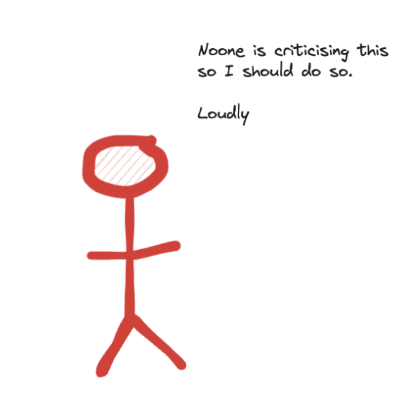
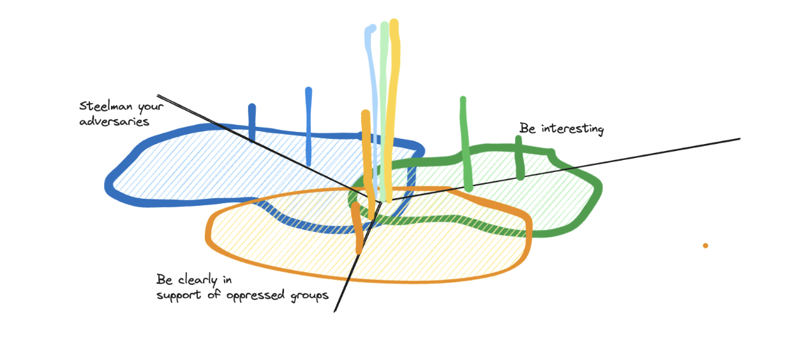
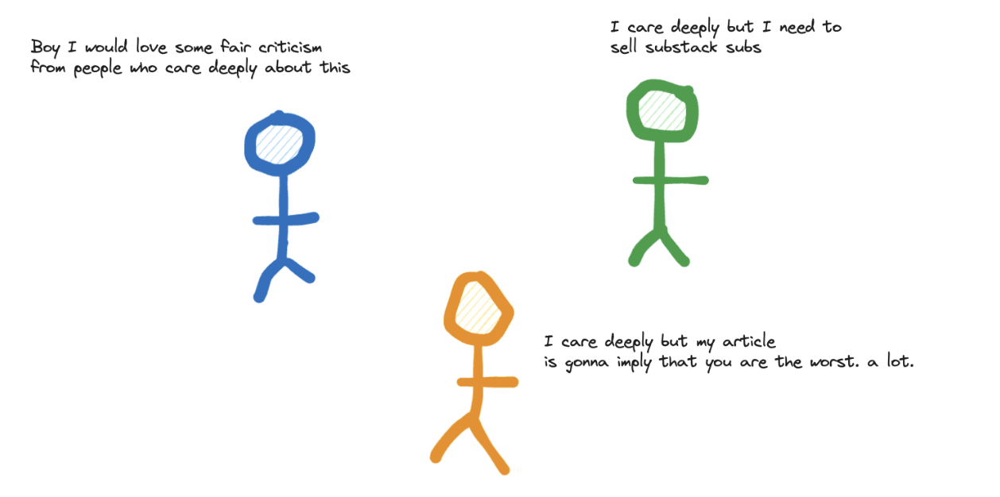

- https://osf.io/preprints/psyarxiv/kgcrq
- Epistemic status: generating theories
- I theorise it's two different effects in one:
	- The voices we hear in the discussion (which links to yours)
	  The norms of the communities holding those voices
- First, as you say, the voices we hear most are the most confident/motivated, which leaves out a lot of voices, many of whom might talk in a way we'd prefer. Instead we only hear from the fringes, which makes a normal distribution look bimodal.
	- 
- I wonder if this is more like supply and demand, about supplying criticism that people demand.  And correcting a status market - [[EA]] is too high status, let's fix it.
- {:height 321, :width 355}
- Secondly, the edges of this normal distribution have different norms. Let's say there are 3 areas:
	- one likes steelmanning in disagreements 
	  one likes making clear to be on the side of minorities
	  one likes being interesting
	  Let's imagine we are discussing something that has people from all these areas.
- The people who like each of these things most strongly perhaps talk more, as in the above example. But not only do they talk more, they talk differently. So now the discussion is polarised in different languages, because the people in the middle are less confident and speak less (this jump feels like weakest step in the argument[1])
- Amount of people with different views (central line is one group of people, who hold all views weakly)
- 
- So now we have this:
- So I think probably my overall thing about why criticism is poor is something like "criticism looks poor to us because it isn't for us". It is for the people in the same communities by whom it is written. And probably to them our pieces look pretty poor as it is.
- 
- Some questions then:
	- How do we respond in language that other groups will understand?
	  Should we want to? Torres for instance seems to be a bit of a bully. But I'm not sure that makes their arguments bad. But if I were doing it they would definitely call me out for it.
	- Is it worth taking time to really try and write the strongest versions of criticism in language we understand. Or find ways for people to signal confusion