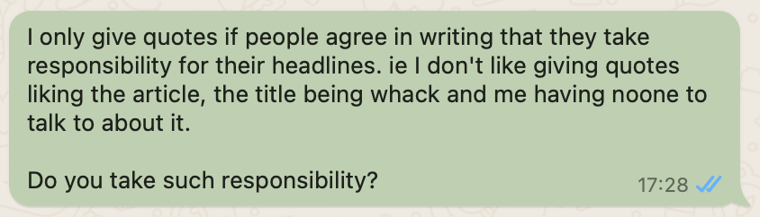

- Advice for reporters
- *How to be a journalist I respect*
- I interact with journalists quite a lot and so I have developed taste. Not just for articles, but for behaviour. And journalists do behave pretty strangely at times.
- Disregard for Privacy and Information Integrity
- I do not trust journalists to abide by norms of privacy. If I talk to a friend and then share what they said, with their name attached, I expect they'd be upset. But journalists regularly act as if their profession sets up the opposite norm - that everything is publishable, unless explicitly agreed otherwise. This is bizarre to me. It's like they have taken a public oath to be untrustworthy.
- Moreover, this isn't how norms work. I can't unilaterally decide that I get to break norms. But journalists have and do. And worse, if challenged on this, I'm not confident they'll acknowledge it. It's not just the norm breaking, it's the gaslighting. *Oh us? No, we're trustworthy. This is just how it works* Journalists have managed my private thoughts worse than almost any person I've ever known and the best I get is a small apology. it is crazy to watch.
- I do not trust journalists to accurately convey what I said or what I meant. If I tell a journalist X, I have to take great lengths to ensure that if my name is publish it is attached to X and not some related statement. And it is even harder to ensure that the title of the article matches the content.
- There are entire organisations staffed with people who regularly mislead, many of whom think they are noble freedom fighters. I don't understand how this façade is maintained. I understand respecting The Economist, and the people who work at Fox News must know they are charlatans, but does the guardian really deserve the high standing it's journalists get, given the misleading pieces it sometimes publishes.
- I think my message to journalists is, if you can't afford to uphold some reasonable standard of ethics, then do a different job. I know that jobs in journalism are hard to come by, but many of you are clever, hard working individuals. You have other options. So either be the journalists you think you are or stop publishing misleading quotes under clickbait titles. Noone forced you to do this. If you choose to, it's on you. ,
- Reporters vs commentators
- At this point, I'd like to make a distinction between what I think of as reporters and commentators.
- Reporters discuss the world as it is, or will be. They write news article and, in my world, would write forecasting articles as well. They are the physicists of the journalism world, reporting how things are, or realistically might be then waiting to test it.
- I also see another group I call commentators, who are spotting patterns and writing about them. Are men getting weaker? Is it all about microplastics? What's going on with Iran? They give concepts that one might use to interpret the world, but accuracy isn't really the point. It's about ideas. To me these people are more like mathematicians - the world they write about is only tangentially related to the real world.
- A friend who used to work in a hedge fund often talks about Eric Weinstein. Weinstein often seems like a crackpot. How is it that he worked at Theil's hedge fund? Well, my friend says that some hedge funds have two types of guys - careful methodical guys and wild idea guys. At a hedge fund, or at least in those days, people are looking for edge. They wanted a way that the world was connected that noone else had noticed.
- And so you want both careful folks and wild idea folks who think there is some connection between pirates and sunspots. Then you get your careful folks to check if there is such a connection. 99 times out of 100 there isn't.
- 
- But 1 in 100 times, there is. And this is where the hedge fund makes it's money.
- To me, journalism can be the same. I would prefer a commentator who is really blindingly insightful 1 time in 100 to someone who is about the same as me all the time - I already know what I think.
- But reporter (who are, in the hedge fund analogy) the careful guys, do need to be.. careful. Their job isn't 1 insight in 100 zany articles. Their job is to let me see the world as it currently is. And potentially to test the theories of commentators.
- But sometimes I worry that they think *they* are the commentators. That all of journalism should be a freewheeling ideas-fest rather than actually telling me what is going on.
- Accuracy
- This last bit then is just for the reporters - those who are trying to tell me how the world is, or will be.
- In my experience reporters often prioritise precision over overall accuracy, potentially compromising the accuracy of their reporting. Many reporters believe their job is to ensure every sentence they write is true, rather than aiming for an accurate piece overall. How can this happen? Well if you only let yourself write true sentences, then there are a lot of tentences you can't write - those containing "maybe" and "perhaps". This approach can lead to a false sense of certainty and often mislead readers. By focusing solely on statements they can justify, journalists risk creating articles that implicitly convey points they wouldn't endorse.
- A more effective approach would be to embrace probability and uncertainty in reporting. Using words like "probably" and "maybe" more frequently could lead to articles that are more accurate overall, even if individual sentences are less definitive. This method would better reflect the complex nature of many news stories where there isn't clear evidence of many aspects of a story.
- Many reporters are happy to retweet or quote dubious information. Their standards for "what can be reported" sometimes allow an inaccurate quote to be shared to millions of people. When questioned on this, their defence is that it is literally true that someone said this, or that the person who reported it is trustworthy. In this way they launder inaccuracy that they would not write in their own voice
- Personal Mitigation Strategies
- I lose respect for journalists who consistently spread inaccuracies, whether they wrote them or are quoting others. I do not accept mealy mouthed words about how it's just normal or this other person is respected. If you publish something, I consider it a bet by you on it being true. If it is false, I deduct money from your social score.
- Likewise, if i am to give reporters quotes, I require them to take responsibility for their headlines.
- 
- I have done this twice. One journalist was happy to accept responsibility and I gave them a quote, another wasn't and I didn't.
- Finally, encouraging journalists to use prediction markets and forecasting tools can help improve the overall quality of reporting. These methods allow reporters to better calibrate their understanding of world events and increase the accuracy of their predictions. By promoting the use of such tools, we can foster a journalistic culture that values accuracy and accountability over sensationalism and unverified claims.
- Reporters vs commentators (similar to facts vs [[Editorial]]s)