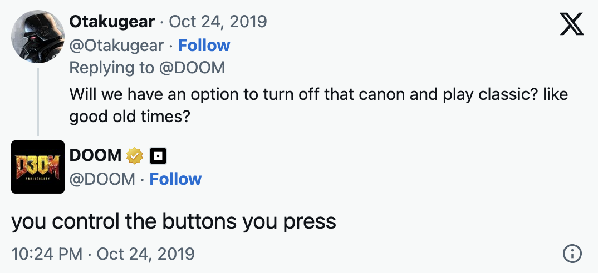
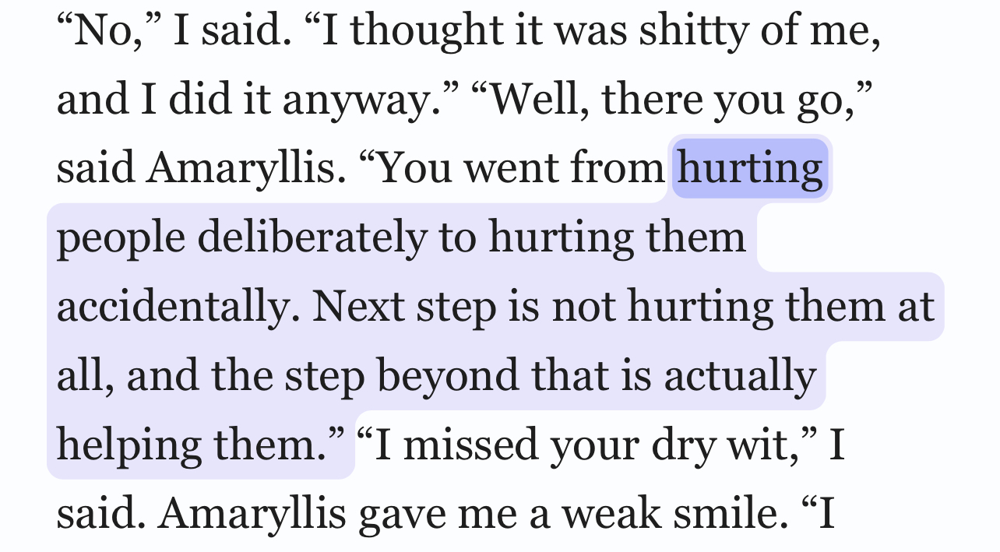
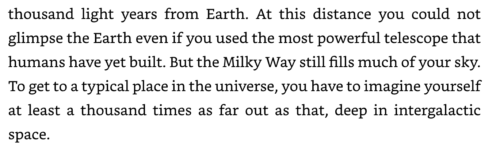

- [[The Bible]] [[Job]] - _I have changed the translation for poetic license_
	- Then the Lord answered Job out of the whirlwind:
	- “Who is this that darkens my counsel
	    with words without knowledge?
	  Brace yourself like a man;
	    I will question you,
	    and you shall answer me.
	- “Where were you when I laid the earth’s foundation?
	    Tell me, if you understand.
	  Who marked off its dimensions? Surely you know!
	    Who stretched a measuring line across it?
	  On what were its footings set,
	    or who laid its cornerstone—
	  while the morning stars sang together
	    and all the angels shouted for joy?
- [[Doom Twitter account]] - {{twitter https://twitter.com/DOOM/status/1187480003635744768}}
	- {:height 273, :width 493}
- [[Eleizer Yudkowsky]]
	- ... Yehuda did not "pass on". Yehuda is not "resting in peace". Yehuda is not coming back. Yehuda doesn't exist any more. Yehuda was absolutely annihilated at the age of nineteen. Yes, that makes me angry. I can't put into words how angry. It would be rage to rend the gates of Heaven and burn down God on Its throne, if any God existed. But there is no God, so my anger burns to tear apart the way-things-are, remake the pattern of a world that permits this ...
- [[Seamus Heaney]] Some Greek play
	- Hope for a sea change on the far side of revenge
- Attributed to my great aunt [[Betty Young]] by iirc her friend [[Ruth]]
	- Well, don't be looking at it.
	  -In the context of a story of removing a tree quickly. Sort of, don't just stand there.
- [[Moby Dick]]
	- median Christians cannibals
- [[Edgar Allen Poe]]
	- "Secretly I am rooting for the organgutan"
- [[Worth The Candle]]
  id:: 655783d1-b81b-4724-a4dd-b51a2bceae90
	- {:height 267, :width 504}
- [[The Beginning of Infinity]]
	- 
- [[Thomas Moore]] [[Martin Luther]]
	- More wrote to Luther about “your shitty mouth, truly the shit-pool of all shit, all the muck and shit which your damnable rottenness has vomited up,” and said of Luther’s followers that they “bespatter the most holy image of Christ crucified with the most foul excrement of their bodies” — bodies “destined to be burned.” Luther, for his part, referred to the “dear little ass-pope,” who licks the Devil’s anus, and said of all the popes, “You are desperate thorough arch-rascals, murderers, traitors, liars, the very scum if all the most evil people on earth. You are full of all the worst devils in hell — full, full and so full that you can do nothings but vomit, throw, and blow out devils.”
	- —from How to Think by Alan Jacobs
- [[Eleizer Yudkowsky]] - https://www.lesswrong.com/posts/uXn3LyA8eNqpvdoZw/preface
	- Despite my mistake, I am happy to say that my readership has so far been amazingly good about *not* using my rhetoric as an excuse to bully or belittle others. (I want to single out [[Scott Alexander]] in particular here, who is a nicer person than I am and an increasingly amazing writer on these topics, and may deserve part of the credit for making the culture of *Less Wrong* a healthy one.)
- “Pyrrhus said to one who was congratulating him on his victory, "If we are victorious in one more battle, we shall be utterly ruined." For he had lost a great part of the forces with which he came, and all his friends and generals except a few.”
- [[Bridgerton]]
	- I love all of you. Even the parts that you believe are too dark and too shameful. Every scar. Every flaw. Every imperfection. I love you. You may think you are too damaged and too broken to ever allow yourself to be happy, but you can choose differently,
- [[Christopher Hitchens]]
	- “That which can be asserted without evidence, can be dismissed without evidence.” *Hitchens’ razor*
- [[Ursula K. Le Guin]]
	- But I didn’t and still don’t like making a cult of women’s knowledge, preening ourselves on knowing things men don’t know, women’s deep irrational wisdom, women’s instinctive knowledge of Nature, and so on. All that all too often merely reinforces the masculinist idea of women as primitive and inferior – women’s knowledge as elementary, primitive, always down below at the dark roots, while men get to cultivate and own the flowers and crops that come up into the light. But why should women keep talking baby talk while men get to grow up? Why should women feel blindly while men get to think?
- {{embed ((66140d88-7eb9-495c-946a-3a932e74eecd))}}
- That quote about people who see blue and green - [[Eleizer Yudkowsky]]
- Hit the bricks [[Scott Alexander]]
- [[Eleizer Yudkowsky]] [[Planecrash]] Try things the easy way first, if you succeed, you won't need to try them the difficult way. If you fail you'll know the first part that makes it difficult instead of guessing it in advance.
- [[Warhammer 40k]] The planet broke before the Guard did.
- [[Spike Milligan]] - https://www.youtube.com/watch?v=v1iVdLSoIRY
	- Joanna Lumley: What makes a good soldier
	- Spike Milligan: Fear
- [[The Bible]] "Deep
-