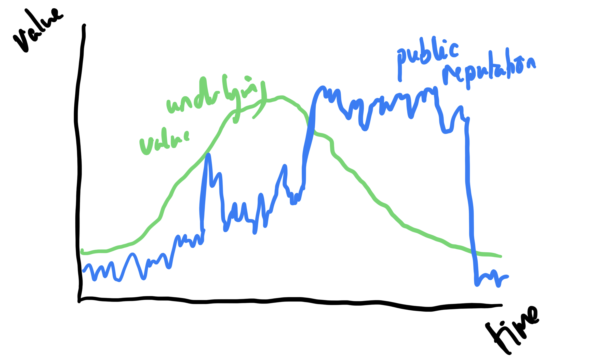

- 
- Value has both a real and perceived component
	- This is a little like markets. That PR is the public relationship, reputation is more closely related to value
	- Links to this https://www.lesswrong.com/posts/SWxnP5LZeJzuT3ccd/pr-is-corrosive-reputation-is-not
- Updates are a bit like markets.
	- Positive pieces are like buying stuff
	- Hit pieces are like shorts
- The update isn't the whole distance but the amount that wouldn't have happened without the update
- News outlets as reputation hedge funds
- Permissioned distrust
	- Who do you feel able to criticise?
- Scandal markets
- Artificial high
	- Many PR firms are about keeping your reputation artificially high