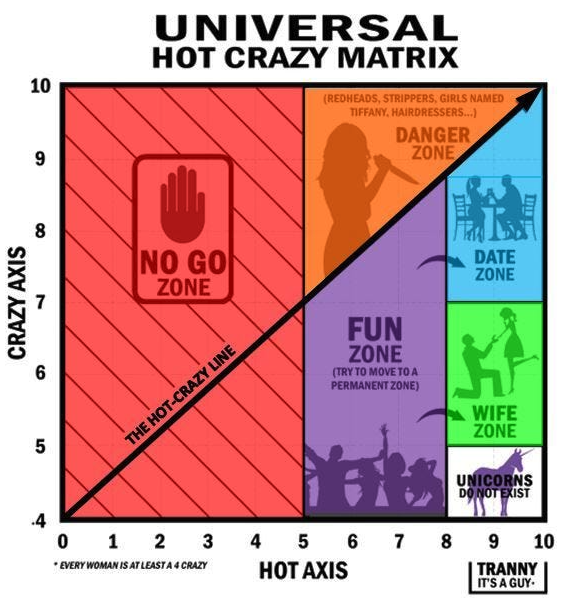

- It was common in the 00s to talk about the "Hot/crazy curve". The notion that as a woman gets more attractive she also likely behaves worse. Rather than say this isn't true, I'll argue that it is true in many other cases - the "high status/crazy curve" - high status people often behave a bit worse, because they can do so without losing their friends/ jobs/ parters.
- {:height 338, :width 226}
- I do not endorse this chart. But it's funny how milquetoast this is by early 00s standards but how many red flags it has. Also that it is both lazily transphobic whilst also being complimentary of trans women. [[The past is a foreign country]]
- If I were just scraping by on jobs/ partners/ friends, I would want to be careful - abide by norms, be kind to those around you who are in a similar situation, try and curry the favour of those who are more powerful. If I made a mistake I might lose friends etc and I have few of those.
- But if I had a lot of those things, then A) I would be less worried about losing the marginal friend/partner and B) my friends and partners might be more permissive to me, excusing my poor behaviour because I am high status.
- This feels like it explains both bad behaviour from hot women, but also from jocks in finance firms, church leaders, billionaires. All these people receive poor feedback from their entourages who don't wish to alienate them.
- Likewise much bad behaviour is advantageous. Lying and bullying both have benefits. So by reducing the costs of this behaviour while the benefits stay the same, the amount of it increase, sometimes to relatively stable equilibria. [[Elon Musk]] has made a name treating his employees (and it should be noted, himself) in a brutal fashion. Perhaps a smaller name would have been penalised for this (likely legal cases) but Musk has pushed through it and created high functioning companies using this strategy.
- Therefore status encourages patterns of bad behaviour. And perhaps sometimes this impunity further rewards status. Attractive men and women being unpredictable and badly behaved is sometimes seen as a further reason to be attracted to them.